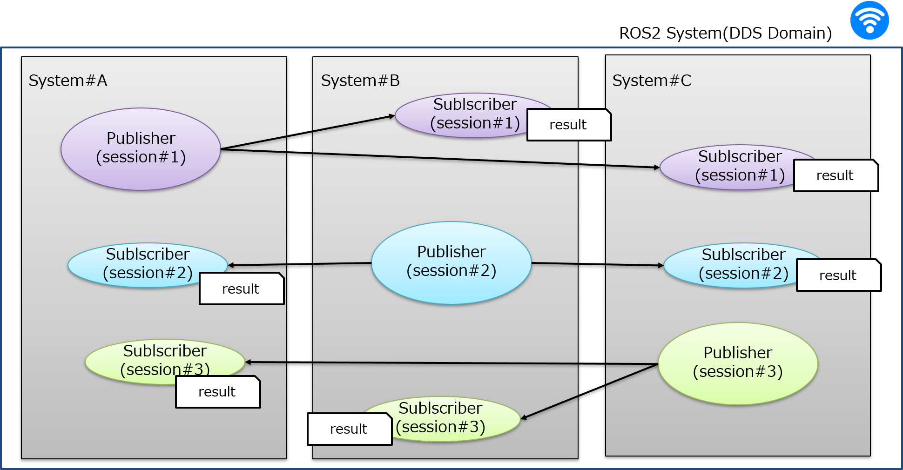

This directory is to test stability of ROS RMW with different DDS vendors,
and it use the following architecture to test.



NOTE: User need to prepare two or more machines to continue to test.

## The description for sub-directory

| Directory Name | Description |
| :--- | :--- |
| design | Include design document [**basic_design.md**](design/basic_design.md). |
| docker | A dockerfile is provided to build a docker image. This environment is used to build test codes and configure test environment. |
| result | Put test result report file and test log. Include below test report. |
|   |[**fastRTPS_openSplice_Skylake_Raspi3_result based on wired&wireless environment**](result/result.md)|
|   | [**fastRTPS_openSplice_Skylake_PowerEdge-T110-II_result based on wired environment**](result/stability_result_wired_20200218.xlsx)   |
|  | [**fasRTPS_cycloneDDS_Skylake_Raspi4_result based on wired&wireless environment**](result/eloquent_fastrtps_cyclonedds_skylake_raspi4/test_result.md) |
| test_stability_msgs | Defined ROS message used for test code. |
| test_stability_nodes | Test codes. |


## Environment preparation

Dockerfile is provided to build a docker image containing ssh service exposed 9922 port.
All of the following steps need to be configured at each machine.

### build docker image

```
# cd {project}/ros_stability_test
# docker build -t ros-eloquent:ros_stability_test -f docker/Dockerfile .
```


### run container

```
# cd {project}/ros_stability_test
# docker run --detach --privileged -v `pwd`:/root/workspace --network=host --name ros_stability_test ros-eloquent:ros_stability_test
```


### build ros_stability_test application

```
# ssh root@{skylake} -p 9922   # password: docker
# cd ~/workspace
# . /opt/ros/eloquent/setup.bash
# colcon build --cmake-args -DCMAKE_BUILD_TYPE=Release
```

NOTE: About ros2 application of arm64, it's better not to build in target machine but to use one of the following methods.
(It takes a lot of time to build application at arm64 target machine)

- use 'qemu' to build arm64 application on host machine, and then copy applications into target machine.
- make a debian package for arm64 by a arm64 docker image of ros on host machine.


### configure ssh authorized keys

If running launch_test at {skylake}, please copy 'id_rsa.pub' of {skylake} into '~/.ssh/authorized_keys' of all remote machines

Before testing, please update 'test_remote.json' with real IP,

- test_stability_nodes/launch_test/test_remote.json

    ```
    [
      {
        "host_name": "skylake",
        "ssh_url": "root@192.168.0.61",
        "ssh_port" : "9922",
        "project_path": "/root/workspace/install"
      },
      {
        "host_name": "rpi3-no1",
        "ssh_url": "root@192.168.0.64",
        "ssh_port" : "9922",
        "project_path": "/root/workspace/install"
      },
      {
        "host_name": "rpi3-no2",
        "ssh_url": "root@192.168.0.65",
        "ssh_port" : "9922",
        "project_path": "/root/workspace/install"
      }
    ]
    ```

and make sure to run 'ssh' command with remote command to test successfully without password.

```
# ssh -o StrictHostKeyChecking=no {ssh_url} -p {ssh_port} ls {project_path}
```

### Configure a wireless test environment [Optional]

Some DDS prefer the wired NIC(network interface card) for communication by default, such as cycloneDDS. Some will use all NICs for communication by default, such as FastRTPS.

So if your device has multiple NIC and you want to do test based on wireless NIC, please perform below steps to bind the wireless NIC.

Here taking fastRTPS & cycloneDDS as an example, if using other DDS, other related configuration files are required.

  ```
  # ssh root@{skylake or Raspi} -p 9922   # password: docker
  # cd ~/workspace/test_stability_nodes/launch_test
  ```
- fastRTPS

  Reference example [https://fast-rtps.docs.eprosima.com/en/latest/advanced.html#whitelist-Interfaces](https://fast-rtps.docs.eprosima.com/en/latest/advanced.html#whitelist-interfaces)

  Before testing, please update \<address> in 'fastrtps.xml' with your real wireless NIC IP
  - test_stability_nodes/launch_test/fastrtps.xml

    ```
    ....
    <transport_descriptor>
        <transport_id>CustomTransport</transport_id>
        <type>UDPv4</type>
        <interfaceWhiteList>
            <address>172.16.78.44</address>   <== replace this IP address.
        </interfaceWhiteList>
    </transport_descriptor>
    ....
    ```
    then add the following line in your **/etc/environment** configuration file.
    ```
    FASTRTPS_DEFAULT_PROFILES_FILE=/root/workspace/test_stability_nodes/launch_test/fastrtps. xml
    ```
- cycloneDDS
  
  Reference example [https://github.com/eclipse-cyclonedds/cyclonedds#configuration](https://github.com/eclipse-cyclonedds/cyclonedds#configuration) and update AllowMulticast with spdp, NetworkInterfaceAddress with your wireless NIC name.
  - test_stability_nodes/launch_test/cyclonedds.xml

    ```
    ....
    <General>
      <NetworkInterfaceAddress>wlan0</NetworkInterfaceAddress>  <== replace your wireless NIC name
      <AllowMulticast>spdp</AllowMulticast>  <== set spdp.
      <MaxMessageSize>65500B</MaxMessageSize>
      <FragmentSize>4000B</FragmentSize>
    </General>
    ....
    ```
    then add the following line in your **/etc/environment** configuration file.
    ```
    CYCLONEDDS_URI=file:///root/workspace/test_stability_nodes/launch_test/cyclonedds.xml
    ```

    !!! note
      You need update both **Skylake** and **Raspi** test machines.

### Time synchronization

Because time lapse is calculated between two machines, please synchronize time from a timer server first.
There are two ways to synchronize time.(one is NTP, and the other is linuxptp.)  
It's better to use linuxptp because it synchronize the clock with better accuracy.

If machines support linuxptp, first make sure the ntp service is stopped in both docker environment and host environment.
```
timedatectl set-ntp false
```
then use linuxptp as follows,

```
master machine
  start master with hardware timestamp mode
  # ptp4l -i enp0s31f6 -m

    or

  start master with software timestamp mode (-S SOFTWARE)
  # ptp4l -i enp0s31f6 -m -S

slave machine
  start slave with hardware timestamp mode (-s slave only)
  # ptp4l -i eno1 -m -s

    or

  start slave with software timestamp mode (-S SOFTWARE -s slave only)
  # ptp4l -i eno1 -m -S -s
```

otherwise, use NTP as follows,
(NOTE: raspberry3B+ NIC does not support linuxptp)

```
# sh -c "echo 'Servers=intp.sm.sony.co.jp' >> /etc/systemd/timesyncd.conf"
# systemctl daemon-reload
# systemctl restart systemd-timesyncd
# ln -sf /usr/share/zoneinfo/Asia/Tokyo /etc/localtime
```


## launch_test Test
- test_remote.py arguments

    ```
    Arguments (pass arguments as '<name>:=<value>'):

        'loop_count':

                    Passed to the sender to set the loop count of publishing test data message
                    format as "loop_count:='-l 1000'"

            (default: '-l 1000')

        'frequency':

                    Passed to the sender to set the frequency of publishing test data message
                    format as "frequency:='-f 100'", the unit is Hz

            (default: '-f 100')

        'qos_profile':

                    Passed to the sender or receiver to set qos profile of test data message
                    format as "qos_profile:='-q 0'", qos_profile can be 0(reliable) or 1(best effort)

            (default: '-q 0')
    ```

- test as follows

    ```
    # ssh root@{skylake} -p 9922
    # cd ~/workspace
    # . install/setup.bash
    # cd ~/workspace/test_stability_nodes/launch_test
    # RMW_IMPLEMENTATION=rmw_fastrtps_cpp TEST_REMOTE_JSON=test_remote.json launch_test test_remote.py loop_count:='-l 100' frequency:='-f 1' qos_profile:='-q 1'
        or
    # RMW_IMPLEMENTATION=rmw_opensplice_cpp TEST_REMOTE_JSON=test_remote.json launch_test test_remote.py loop_count:='-l 100' frequency:='-f 1' qos_profile:='-q 1'
        or
    # RMW_IMPLEMENTATION=rmw_cyclonedds_cpp TEST_REMOTE_JSON=test_remote.json launch_test test_remote.py loop_count:='-l 100' frequency:='-f 1' qos_profile:='-q 1'
    ```
