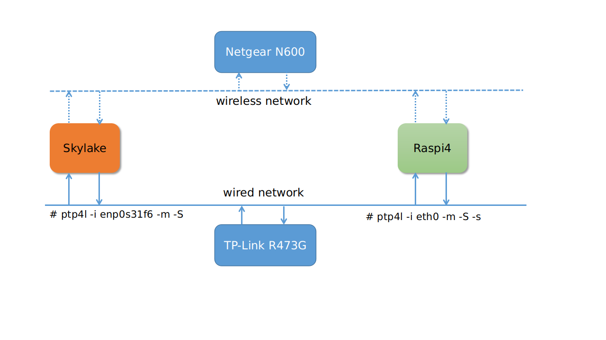

# Test result {ignore=true}

## Content {ignore=true}
<!-- @import "[TOC]" {cmd="toc" depthFrom=1 depthTo=6 orderedList=false} -->

<!-- code_chunk_output -->

- [Test result {ignore=true}](#test-result-ignoretrue)
  - [Content {ignore=true}](#content-ignoretrue)
  - [Test Environment](#test-environment)
  - [Test statistics of wired environment](#test-statistics-of-wired-environment)
  - [Test statistics of wireless environment](#test-statistics-of-wireless-environment)
  - [Iperf Statictics](#iperf-statictics)
    - [Test method](#test-method)
    - [Result](#result)
  - [Analysis](#analysis)
    - [error1](#error1)
    - [error2](#error2)
  - [Attachment](#attachment)
  - [Comparing test result with Tokyo side environment](#comparing-test-result-with-tokyo-side-environment)

<!-- /code_chunk_output -->

## Test Environment

- Hardware

    - Skylake

        GenuineIntel Intel(R) Core(TM) i7-6700K CPU(x8) @ 4.00GHz, memory 16GiB

    - Raspberry Pi 4 Model B Rev 1.1

        Broadcom BCM2711, Quad core Cortex-A72 (ARM v8) 64-bit SoC @ 1.5GHz, memory 3.7GiB

    - Netgear (WNDR3700v4) N600 Wireless Dual Band Router

        This router is used for both wired and wireless tests.

    - TP-Link (R473G) Router

        This router used for time synchronization, because both skylake and raspi4 wireless network cards do not support linuxptp, so we need the wired ethernet interface to keep time synchronization, see the diagram below:



- Software

    - Host
        - Ubuntu 18.04.4 Bionic on skylake
        - Ubuntu 18.04.4 Bionic on Raspi4
    - Docker image
        - ROS2 Eloquent


## Test statistics of wired environment

- Publisher:Subscriber(s)=1:1, test result of message_size(4KB), loop_count(100), frequency(10.000000)

    - qos_profile(best effort)

        | type | rmw | name | average(s) | min(s) | max(s) | lost count |
        | --- | --- | --- | --- | --- | --- | --- |
        | wired | fastrtps | Skylake-TO-Raspi4 | 0.000597697 | 0.000448314 | 0.000732244 | 0 |
        | wired | fastrtps | Raspi4-TO-Skylake | 0.000610265 | 0.000484493 | 0.000870616 | 0 |
        | wired | cyclonedds | Skylake-TO-Raspi4 | 0.000699721 | 0.000607326 | 0.000899633 | 0 |
        | wired | cyclonedds | Raspi4-TO-Skylake | 0.000498679 | 0.000445642 | 0.000598742 | 0 |

    - qos_profile(reliable)

        | type | rmw | name | average(s) | min(s) | max(s) | lost count |
        | --- | --- | --- | --- | --- | --- | --- |
        | wired | fastrtps | Skylake-TO-Raspi4 | 0.000656657 | 0.000593832 | 0.001043250 | 0 |
        | wired | fastrtps | Raspi4-TO-Skylake | 0.000643777 | 0.000576635 | 0.000862002 | 0 |
        | wired | cyclonedds | Skylake-TO-Raspi4 | 0.000623475 | 0.000412760 | 0.000735491 | 0 |
        | wired | cyclonedds | Raspi4-TO-Skylake | 0.000548489 | 0.000452053 | 0.000673224 | 0 |

- Publisher:Subscriber(s)=1:1, test result of message_size(64KB), loop_count(100), frequency(10.000000)

    - qos_profile(best effort)

        | type | rmw | name | average(s) | min(s) | max(s) | lost count |
        | --- | --- | --- | --- | --- | --- | --- |
        | wired | fastrtps | Skylake-TO-Raspi4 | 0.001687316 | 0.001524064 | 0.002856801 | 0 |
        | wired | fastrtps | Raspi4-TO-Skylake | 0.002689017 | 0.001931587 | 0.003574122 | 0 |
        | wired | cyclonedds | Skylake-TO-Raspi4 | 0.001852601 | 0.001172348 | 0.002275838 | 0 |
        | wired | cyclonedds | Raspi4-TO-Skylake | 0.002176060 | 0.002016989 | 0.002539799 | 0 |

    - qos_profile(reliable)

        | type | rmw | name | average(s) | min(s) | max(s) | lost count |
        | --- | --- | --- | --- | --- | --- | --- |
        | wired | fastrtps | Skylake-TO-Raspi4 | 0.001809093 | 0.001493037 | 0.002640674 | 0 |
        | wired | fastrtps | Raspi4-TO-Skylake | 0.002795928 | 0.002243381 | 0.003702568 | 0 |
        | wired | cyclonedds | Skylake-TO-Raspi4 | 0.001905045 | 0.001763925 | 0.002214585 | 0 |
        | wired | cyclonedds | Raspi4-TO-Skylake | 0.002161125 | 0.002062141 | 0.002654086 | 0 |

- Publisher:Subscriber(s)=1:1, test result of message_size(256KB), loop_count(100), frequency(10.000000)

    - qos_profile(best effort)

        | type | rmw | name | average(s) | min(s) | max(s) | lost count |
        | --- | --- | --- | --- | --- | --- | --- |
        | wired | fastrtps | Skylake-TO-Raspi4 | 0.005818507 | 0.005257370 | 0.007038056 | 0 |
        | wired | fastrtps | Raspi4-TO-Skylake | 0.008556663 | 0.007102931 | 0.012292408 | 0 |
        | wired | cyclonedds | Skylake-TO-Raspi4 | 0.006038686 | 0.005625354 | 0.006824310 | 0 |
        | wired | cyclonedds | Raspi4-TO-Skylake | 0.007710621 | 0.003845420 | 0.008796202 | 0 |

    - qos_profile(reliable)

        | type | rmw | name | average(s) | min(s) | max(s) | lost count |
        | --- | --- | --- | --- | --- | --- | --- |
        | wired | fastrtps | Skylake-TO-Raspi4 | 0.016357923 | 0.005366243 | 1.018966676 | 0 |
        | wired | fastrtps | Raspi4-TO-Skylake | 0.008401691 | 0.007085782 | 0.013205948 | 0 |
        | wired | cyclonedds | Skylake-TO-Raspi4 | 0.005739081 | 0.004946996 | 0.006985877 | 0 |
        | wired | cyclonedds | Raspi4-TO-Skylake | 0.007771703 | 0.007382589 | 0.009490403 | 0 |

- Publisher:Subscriber(s)=1:1, test result of message_size(2MB), loop_count(100), frequency(10.000000)

    - qos_profile(best effort)

        | type | rmw | name | average(s) | min(s) | max(s) | lost count |
        | --- | --- | --- | --- | --- | --- | --- |
        | wired | fastrtps | Skylake-TO-Raspi4 | 0.037801811 | 0.037209377 | 0.040952117 | 2 |
        | wired | fastrtps | Raspi4-TO-Skylake | 0.041107859 | 0.039031905 | 0.047552529 | 0 |
        | wired | cyclonedds | Skylake-TO-Raspi4 | 0.029777843 | 0.026511385 | 0.036587818 | 0 |
        | wired | cyclonedds | Raspi4-TO-Skylake | 0.030970959 | 0.029468320 | 0.038673856 | 0 |

    - qos_profile(reliable)

        | type | rmw | name | average(s) | min(s) | max(s) | lost count |
        | --- | --- | --- | --- | --- | --- | --- |
        | wired | fastrtps | Skylake-TO-Raspi4 | 0.038000888 | 0.037200859 | 0.044644103 | 0 |
        | wired | fastrtps | Raspi4-TO-Skylake | 0.042042075 | 0.039737039 | 0.047436176 | 0 |
        | wired | cyclonedds | Skylake-TO-Raspi4 | 0.027264072 | 0.023987589 | 0.036958518 | 0 |
        | wired | cyclonedds | Raspi4-TO-Skylake | 0.030786382 | 0.026099573 | 0.036018268 | 0 |

- Publisher:Subscriber(s)=1:1, test result of message_size(8MB), loop_count(100), frequency(10.000000)

    - qos_profile(best effort)

        | type | rmw | name | average(s) | min(s) | max(s) | lost count |
        | --- | --- | --- | --- | --- | --- | --- |
        | wired | fastrtps | Skylake-TO-Raspi4 | 0.149458542 | 0.148493643 | 0.158549459 | 0 |
        | wired | fastrtps | Raspi4-TO-Skylake | 0.149656596 | 0.146646508 | 0.167911097 | 0 |
        | wired | cyclonedds | Skylake-TO-Raspi4 | 0.097488841 | 0.093881512 | 0.110648635 | 1 |
        | wired | cyclonedds | Raspi4-TO-Skylake | 0.114491101 | 0.106530690 | 0.141855568 | 0 |

    - qos_profile(reliable)

        | type | rmw | name | average(s) | min(s) | max(s) | lost count |
        | --- | --- | --- | --- | --- | --- | --- |
        | wired | fastrtps | Skylake-TO-Raspi4 | 0.153357962 | 0.148851793 | 0.175741360 | 0 |
        | wired | fastrtps | Raspi4-TO-Skylake | 0.148711196 | 0.145651580 | 0.160524721 | 0 |
        | wired | cyclonedds | Skylake-TO-Raspi4 | 0.095226161 | 0.092543964 | 0.110329363 | 0 |
        | wired | cyclonedds | Raspi4-TO-Skylake | 0.112931173 | 0.101286280 | 0.155737089 | 0 |
## Test statistics of wireless environment

While preparing environment, please refer to section ***Configure a wireless test environment [Optional]*** in [README.md](../../README.md)

- Publisher:Subscriber(s)=1:1, test result of message_size(4KB), loop_count(100), frequency(10.000000)

    - qos_profile(best effort)

        | type | rmw | name | average(s) | min(s) | max(s) | lost count |
        | --- | --- | --- | --- | --- | --- | --- |
        | wireless | fastrtps | Skylake-TO-Raspi4 | 0.008297328 | 0.004011508 | 0.023206738 | 0 |
        | wireless | fastrtps | Raspi4-TO-Skylake | 0.141449315 | 0.003516024 | 0.583809758 | 0 |
        | wireless | cyclonedds | Skylake-TO-Raspi4 | 0.007102862 | 0.004381429 | 0.012624013 | 0 |
        | wireless | cyclonedds | Raspi4-TO-Skylake | 0.138029375 | 0.015941338 | 0.575042037 | 0 |

    - qos_profile(reliable)

        | type | rmw | name | average(s) | min(s) | max(s) | lost count |
        | --- | --- | --- | --- | --- | --- | --- |
        | wireless | fastrtps | Skylake-TO-Raspi4 | 0.009026767 | 0.004452264 | 0.018543527 | 0 |
        | wireless | fastrtps | Raspi4-TO-Skylake | 0.125444252 | 0.017302906 | 0.363546711 | 0 |
        | wireless | cyclonedds | Skylake-TO-Raspi4 | 0.006959864 | 0.003723451 | 0.014466303 | 0 |
        | wireless | cyclonedds | Raspi4-TO-Skylake | 0.114878247 | 0.012040311 | 0.221893478 | 0 |

- Publisher:Subscriber(s)=1:1, test result of message_size(64KB), loop_count(100), frequency(10.000000)

    - qos_profile(best effort)

        | type | rmw | name | average(s) | min(s) | max(s) | lost count |
        | --- | --- | --- | --- | --- | --- | --- |
        | wireless | fastrtps | Skylake-TO-Raspi4 | 0.019474921 | 0.013684024 | 0.038192838 | 0 |
        | wireless | fastrtps | Raspi4-TO-Skylake | 0.131092085 | 0.016207980 | 0.397809498 | 7 |
        | wireless | cyclonedds | Skylake-TO-Raspi4 | 0.018951905 | 0.014208797 | 0.028361848 | 0 |
        | wireless | cyclonedds | Raspi4-TO-Skylake | 0.122376846 | 0.014657974 | 0.369608719 | 1 |

    - qos_profile(reliable)

        | type | rmw | name | average(s) | min(s) | max(s) | lost count |
        | --- | --- | --- | --- | --- | --- | --- |
        | wireless | fastrtps | Skylake-TO-Raspi4 | 0.019403373 | 0.013581577 | 0.033888078 | 0 |
        | wireless | fastrtps | Raspi4-TO-Skylake | 0.135382465 | 0.020158969 | 0.371769301 | 0 |
        | wireless | cyclonedds | Skylake-TO-Raspi4 | 0.017535208 | 0.013566628 | 0.024772507 | 0 |
        | wireless | cyclonedds | Raspi4-TO-Skylake | 0.121045837 | 0.018620547 | 0.358381902 | 0 |

- Publisher:Subscriber(s)=1:1, test result of message_size(256KB), loop_count(100), frequency(10.000000)

    - qos_profile(best effort)

        | type | rmw | name | average(s) | min(s) | max(s) | lost count |
        | --- | --- | --- | --- | --- | --- | --- |
        | wireless | fastrtps | Skylake-TO-Raspi4 | 0.046104590 | 0.034516658 | 0.105899830 | 0 |
        | wireless | fastrtps | Raspi4-TO-Skylake | 0.038615965 | 0.036805572 | 0.039907372 | 80 |
        | wireless | cyclonedds | Skylake-TO-Raspi4 | 0.060787126 | 0.034889234 | 0.411637978 | 0 |
        | wireless | cyclonedds | Raspi4-TO-Skylake | 0.040311287 | 0.033921267 | 0.048998968 | 90 |

    - qos_profile(reliable)

        | type | rmw | name | average(s) | min(s) | max(s) | lost count |
        | --- | --- | --- | --- | --- | --- | --- |
        | wireless | fastrtps | Skylake-TO-Raspi4 | 0.043667305 | 0.033786943 | 0.064316944 | 0 |
        | wireless | fastrtps | Raspi4-TO-Skylake | 9.469915353 | 0.042105289 | 29.259413379 | 0 |
        | wireless | cyclonedds | Skylake-TO-Raspi4 | 0.046435686 | 0.035455864 | 0.098426888 | 0 |
        | wireless | cyclonedds | Raspi4-TO-Skylake | 0.317538443 | 0.030456155 | 1.047028543 | 0 |

- Publisher:Subscriber(s)=1:1, test result of message_size(2MB), loop_count(100), frequency(10.000000)

    - qos_profile(best effort)

        | type | rmw | name | average(s) | min(s) | max(s) | lost count |
        | --- | --- | --- | --- | --- | --- | --- |
        | wireless | fastrtps | Skylake-TO-Raspi4 | 0.295294309 | 0.252078880 | 0.509317026 | 18 |
        | wireless | fastrtps | Raspi4-TO-Skylake ([error1](#error1)) | 0.000000000 | 0.000000000 | 0.000000000 | 100 |
        | wireless | cyclonedds | Skylake-TO-Raspi4 | 0.299793421 | 0.278183523 | 0.334167936 | 65 |
        | wireless | cyclonedds | Raspi4-TO-Skylake | 0.256512800 | 0.256512800 | 0.256512800 | 37 |

    - qos_profile(reliable)

        | type | rmw | name | average(s) | min(s) | max(s) | lost count |
        | --- | --- | --- | --- | --- | --- | --- |
        | wireless | fastrtps | Skylake-TO-Raspi4 | 0.378373544 | 0.306373667 | 0.520512000 | 0 |
        | wireless | fastrtps | Raspi4-TO-Skylake ([error2](#error2)) |  |  |  |  |
        | wireless | cyclonedds | Skylake-TO-Raspi4 | 38.269438174 | 0.291828308 | 76.733998761 | 0 |
        | wireless | cyclonedds | Raspi4-TO-Skylake | 37.346128830 | 0.411951556 | 79.707816489 | 0 |

- Publisher:Subscriber(s)=1:1, test result of message_size(8MB), loop_count(100), frequency(10.000000)

    - qos_profile(best effort)

        | type | rmw | name | average(s) | min(s) | max(s) | lost count |
        | --- | --- | --- | --- | --- | --- | --- |
        | wireless | fastrtps | Skylake-TO-Raspi4 | 1.285219878 | 1.171957147 | 1.398482610 | 4 |
        | wireless | fastrtps | Raspi4-TO-Skylake ([error1](#error1)) | 0.000000000 | 0.000000000 | 0.000000000 | 100 |
        | wireless | cyclonedds | Skylake-TO-Raspi4 ([error1](#error1)) | 0.000000000 | 0.000000000 | 0.000000000 | 100 |
        | wireless | cyclonedds | Raspi4-TO-Skylake ([error1](#error1)) | 0.000000000 | 0.000000000 | 0.000000000 | 100 |

    - qos_profile(reliable)

        | type | rmw | name | average(s) | min(s) | max(s) | lost count |
        | --- | --- | --- | --- | --- | --- | --- |
        | wireless | fastrtps | Skylake-TO-Raspi4 ([error2](#error2)) |  |  |  |  |
        | wireless | fastrtps | Raspi4-TO-Skylake ([error2](#error2)) |  |  |  |  |
        | wireless | cyclonedds | Skylake-TO-Raspi4 ([error1](#error1)) | 0.000000000 | 0.000000000 | 0.000000000 | 100 |
        | wireless | cyclonedds | Raspi4-TO-Skylake ([error1](#error1)) | 0.000000000 | 0.000000000 | 0.000000000 | 100 |

## Iperf Statictics

### Test method

About iperf result of maximum capability, test method as follows,

- iperf server

    ```
    # iperf3 -s
    ```

- iperf client for UDP

    ```
    # iperf3 -c {REMOTE_IP} -u -b 1000M -l 65507
    NOTE: "-b 1000M" is to use maximum enough bandwidth to get an accurate result, it is better to greater than or equal to real bandwidth of NIC.
          "-l 65507" is the maximum buffer length value which is almost the same as the fragment size of DDS.
    ```

### Result

| type | direction | transfer(actual) | bandwidth | jitter | lost/total Datagrams |
| :-- | :-- | :-- | :-- | :-- | :-- |
| wired | Skylake-TO-Raspi4 | 1.10 GBytes | 945 Mbits/sec | 0.019 ms | 0/18027 (0%) |
| wired | Raspi4-TO-Skylake | 1.10 GBytes | 944 Mbits/sec | 0.065 ms | 0/18007 (0%) |
| wireless | Skylake-TO-Raspi4 | 75.8 MBytes | 63.6 Mbits/sec | 4.477 ms | 62/592 (10%) |
| wireless | Raspi4-TO-Skylake | 95.1 MBytes | 79.8 Mbits/sec | 13.831 ms | 1302/1394 (93%) |

## Analysis

### error1

Test result has been gotten. But all messages are lost.

### error2

Test result cannot be gotten.
There are 2 cases which lead to this issue. One of below messages or both are lost. Even if set **reliable** to make sure message can be received. But while network quality is very bad, this leads liveliness check issue (That is, publisher does not detect subscriber is alive). Below message never is sent at this scenario

1. A message(finished) is sent from sender to receiver. Notify receiver all test data has been sent.

2. A message(result) is sent from receiver to sender. This message include test result. After receiver get above message to know all test data has been sent, receiver will prepare test result and send test result to sender.

## Attachment

You can download the test logs [test_log_202004220712.zip](log/test_log_202004220712.zip).

## Comparing test result with Tokyo side environment

Test result for wireless is affected by many factors, so only compare test result of wired. Please look at below file.
[compare_test_result_20200423.xlsx](./file/compare_test_result_20200423.xlsx)
Based on the result of iperf, the result of Skylake-TO-Raspi4 is almost the same as Tokyo side. But for Raspi4-TO-Skylake, the performance is a little worse than Tokyo side.  

Performance result of Skylake-TO-Raspi4 is better than Tokyo side (Most cases). Performance result of Raspi4-TO-Skylake is a little worse than Tokyo side (Some of case become more worse （Big message size）, but maybe fluctuation of test result.)

Note that ubuntu 18.04.4 is installed on Raspi4 in CSC side. But ubuntu 19.04 is used for Raspi4 in Tokyo side.
